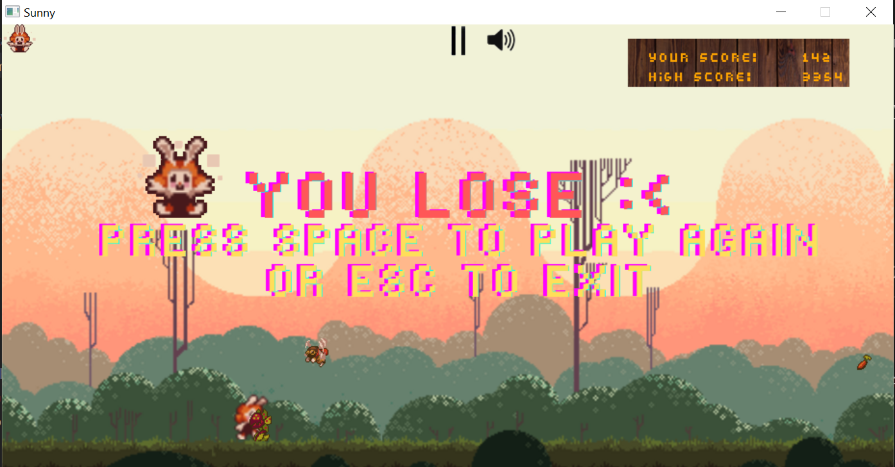

# Dự án cuối kì lớp học phần INT2215 1 - Lập trình nâng cao
## NGUYỄN NHƯ THẢO -21020402
### 1. Hướng dẫn cài đặt:
- Vào link [GitHub](https://github.com/21020402-NguyenNhuThao/GameProject.git) để clone về máy.
- Chạy chương trình:
    + Cách 1: Ấn đúp chuột vào file program.exe 
    + Cách 2:
        + Mở terminal
        + Nhập lệnh .\program rồi bấm enter
### 2. Mô tả chung về trò chơi, các ý tưởng chính
#### a, Mô tả chung về trò chơi
+ Tên game: SunnyLand
+ Demo hình ảnh :

+ Ý tưởng: Dựa trên cách chơi của game DinoChrome.
+ Cách chơi: 
    + Ấn phím Space để vượt chướng ngại vật (Cây, ốc sên và ong). Va chạm với chướng ngại vật nhiều lần sẽ bị giảm máu.
    + Ăn carrot sẽ giúp nhân vật hồi máu trở lại.
    + Game sẽ kết thúc khi nhân vật hết máu.
    + Thời gian sống càng lâu thì điểm càng cao.)
#### b, Các ý tưởng chính
+ Chuyển động nhân vật (nhảy lên), chuyển động chướng ngại vật, thức ăn, background.
+ Xây dựng hệ thống nút (Play, Help, Exit, Pause, Continue, Sound).
+ Hệ thống âm thanh.
### 3. Các chức năng được cài đặt trong trò chơi:
+ Xây dựng Menu với các nút (Play, Help, Exit)
+ Xây dựng nút pause, continue, bật tắt âm thanh
+ Lớp nhân vật, chướng ngại vật và thức ăn.
+ Background chuyển động 
+ Nhạc nền, âm thanh mỗi khi chuyển động nhảy lên của nhân vật và va chạm với chướng ngại vật.
+ Hiện thị máu của nhân vật.
+ Hiện thị điểm số hiện tại và điểm cao nhất.
+ [VideoDemo](https://www.youtube.com/watch?v=MXgQxKv6hxc)
### 4. Các kỹ thuật lập trình sử dụng trong project:
+ Sử dụng âm thanh, đồ họa trong SDL2.
+ Kỹ thuật hướng đối tượng
+ Kỹ thuật tách file
+ Các cấu trúc trong lập trình: con trỏ, mảng, vector, vòng lặp, sinh số ngẫu nhiên, đọc nhập file...

### 5.Kết luận, hướng phát triển và các điều tâm đắc rút ra được sau khi hoàn thiện chương trình:
+ Hướng phát triển:
    + Cho thêm chướng ngại vật xuất hiện, tăng tương tác giữa nhân vật và kẻ thù(va chạm, bắn đạn...)
    + Bảng xếp hạng cho người chơi.
    + Nhập tên cho người chơi...
    + Cho thêm lựa chọn nhân vật.
+ Điều tâm đắc:
    + Làm được 1 game hoàn thiện của riêng mình.
    + Học được thêm nhiều kiến thức về đồ họa, hiểu cơ bản một game 2D được hình thành như thế nào.
    + Làm bài tập lớn học được nhiều kiến thức mới, củng cố được thêm kiến thức về C++. 
### 6.Nguồn tham khảo và tài nguyên game:
+ GameDinoInJungle
+ [Đồ họa nền hình ảnh game](https://itch.io/search?q=parallax+background)
+ [Đồ họa nhân vật](
https://www.spriters-resource.com/pc_computer/heroes3/)
+ [LazyFoo](https://lazyfoo.net/tutorials/SDL/index.php)
+ Visual Studio Code
+ Thư viện SDL2

